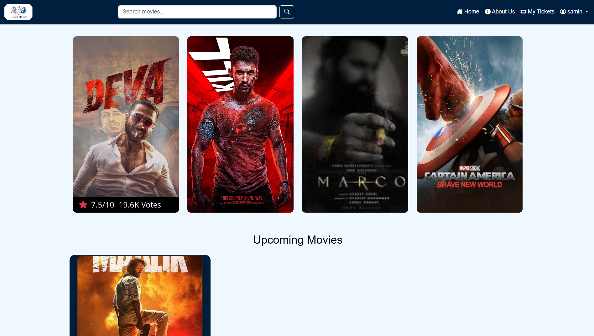

# 🎟️ Ticket Master — Online Movie Ticket Booking Website

Welcome to **Ticket Master**, a user-friendly, modern, responsive movie ticket booking website where you can discover movies, check details, and book tickets with ease.

---

## 📌 Features

✨ **Key Features:**

- 🎬 Browse **Upcoming** & **Now Showing** movies
- 🗂️ See movie details — title, genre, release date
- 🖼️ Movie images & default fallback images
- 📅 Dynamic upcoming/released movie filtering
- 🛒 Ticket booking flow (extendable)
- 🛡️ Secure PHP sessions
- 🧑‍💻 Admin panel to manage:
  - Movies
  - Theaters
  - Showtimes
  - Seats
  - Reports
  - Booking details
- 📊 Booking & revenue reports
- 📱 Fully responsive layout using **Bootstrap 5**
- ⚡ Clean UI animations & hover effects

---

## 🛠️ Tech Stack

- **Frontend:** HTML5, CSS3, Bootstrap 5, JS
- **Backend:** PHP 7+ (or 8+ recommended)
- **Database:** MySQL
- **Extras:** jQuery (optional), Carousel, Font Awesome

---

## 📂 Folder Structure

/ticket-master
- ├── /admin # Admin dashboard & management
- ├── /includes # Header, footer, sidebar, DB connection
- ├── /uploads # Uploaded movie images & fallback images
- ├── carousel.php # Homepage carousel
- ├── connection.php # Database connection config
- ├── index.php # Homepage (Upcoming & Released Movies)
- ├── movie_details.php # Single movie page
- └── README.md # This file!

---

## 💻 Usage
Visit the homepage to see Upcoming & Released movies.

Click any movie card for details.

Extend the booking logic as needed.

---
## 🧩 Screenshots

| Homepage |
|----------|
|  |

  Demo link: https://ticketmaster.html-5.me

| ID         | Username                        | Password |
|------------|----------------------------------|----------|
| User ID    | samin                           | 123      |
| Admin ID   | samin                           | 123      |
| Theater ID | saminkadivar1@gmail.com         | 123      |

## 📝 License
This project is free for learning & personal use.
Please don’t use it for commercial purposes without permission.

----

## 👨‍💻 Author
Created by [Samin kadivar].

Connect with me on LinkedIn.

Feel free to reach out for any help or collaboration!
